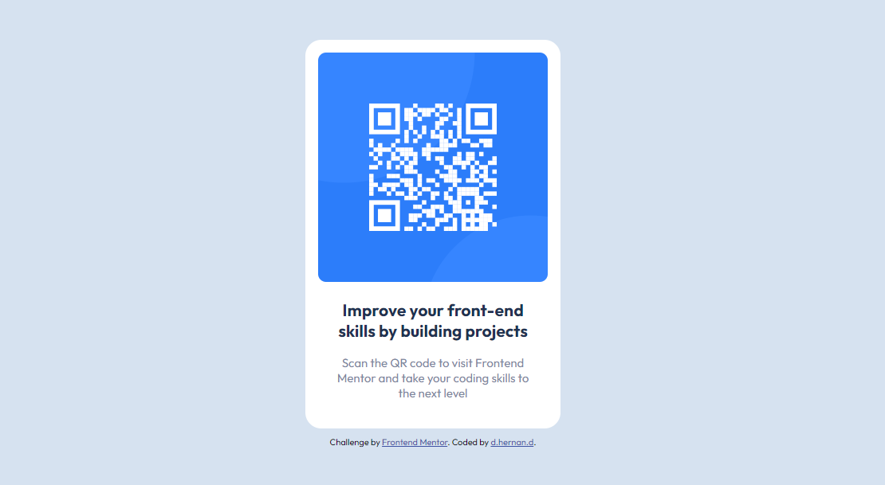

# Frontend Mentor: Solución de componente de código QR

Esta es una solución al [desafío del componente de código QR en Frontend Mentor](https://www.frontendmentor.io/challenges/qr-code-component-iux_sIO_H).

## Captura de pantalla

## Enlaces

- URL del sitio: [Componente de código QR]()

## Construido con

- Marcado HTML5
- Propiedades personalizadas de CSS
- Flexbox

## Autor

- Perfil de Frontend Mentor - [@Hernand3z](https://www.frontendmentor.io/profile/Hernand3z)
